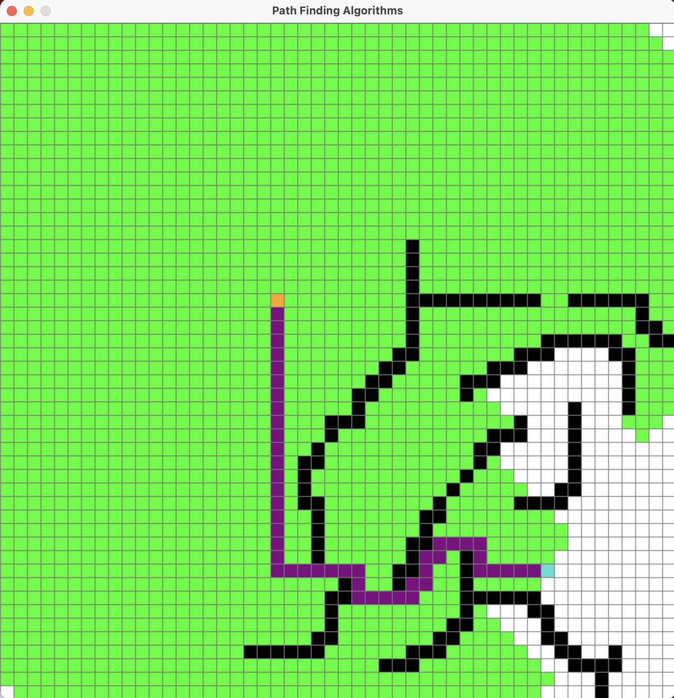
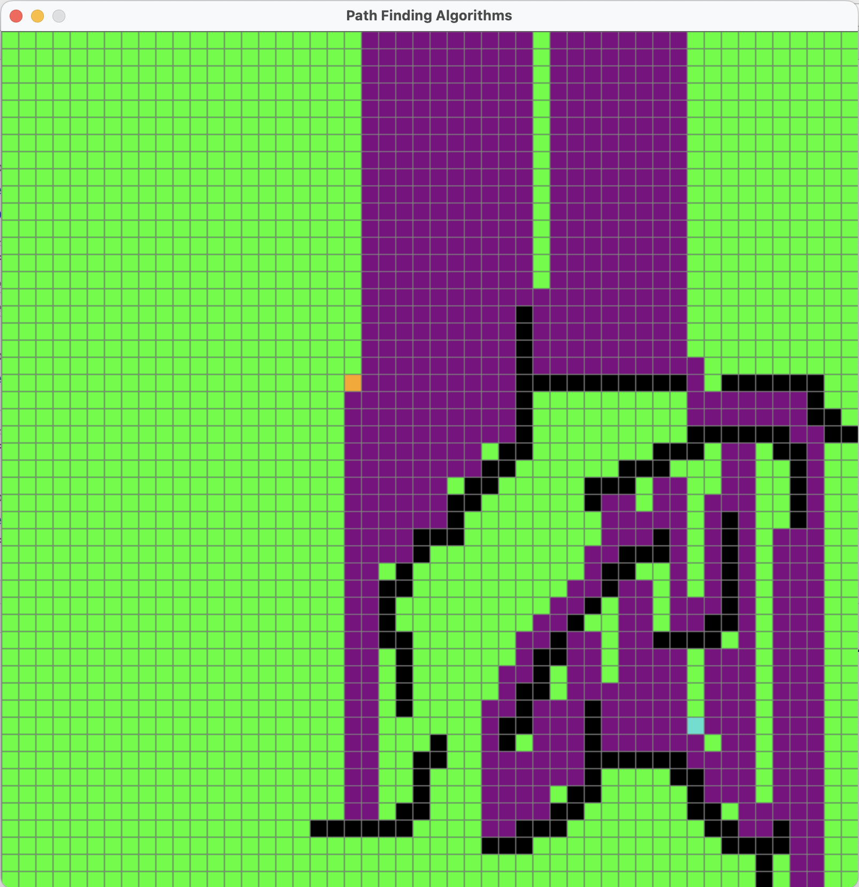
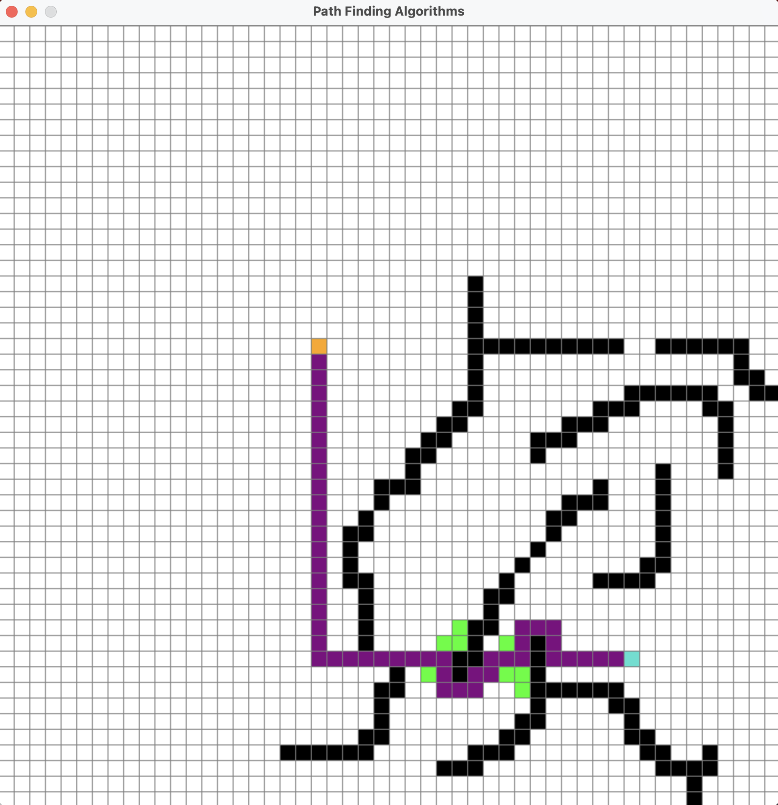
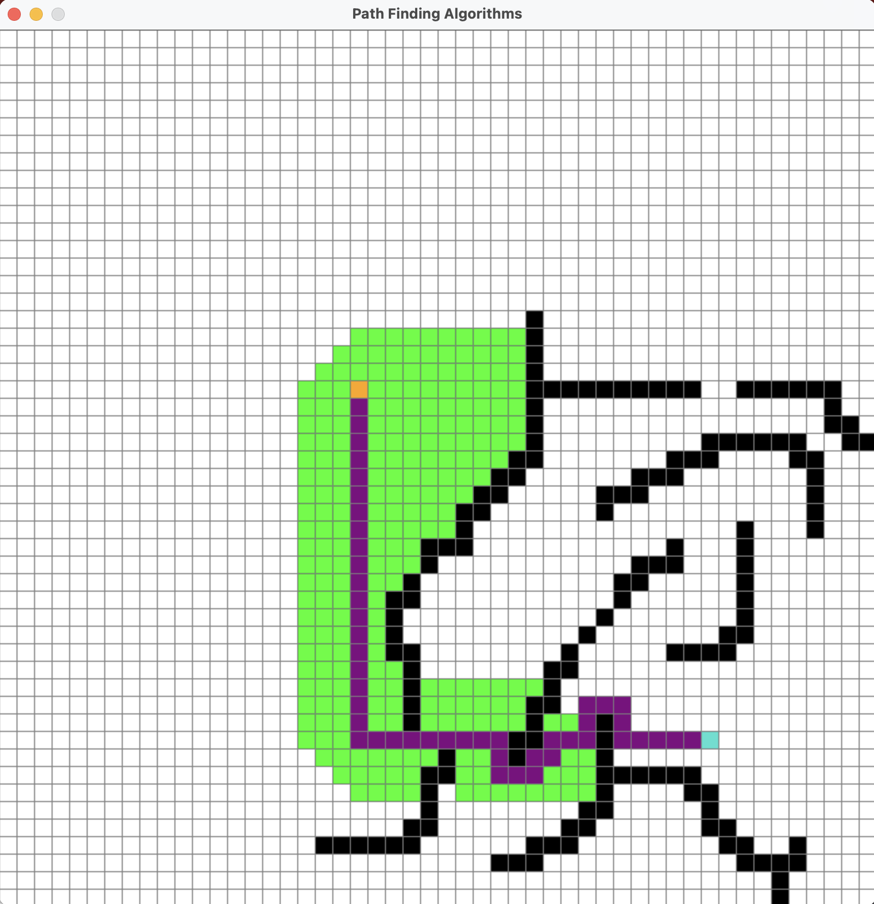

<h1>Path Finding</h1>

Path Finding, or search, is an integral part of AI. It helps in problem solving across a wide variety of domains where a solution isn’t immediately clear. You will implement several graph search algorithms with the goal of solving bi-directional and tri-directional search.

<h2>Breadth First Search</h2>
The Breadth First Search (BFS) algorithm is used to search a graph data structure for a node that meets a set of criteria. It starts at the root of the graph and visits all nodes at the current depth level before moving on to the nodes at the next depth level.

<h2>Depth First Search</h2>
Depth-first search (DFS) is an algorithm for traversing or searching tree or graph data structures. The algorithm starts at the root node (selecting some arbitrary node as the root node in the case of a graph) and explores as far as possible along each branch before backtracking.

<h2>Greedy Search</h2>
Greedy best-first search is an informed search algorithm where the evaluation function is strictly equal to the heuristic function, disregarding the edge weights in a weighted graph because only the heuristic value is considered.

<h2>Dijkstra Search</h2>
Dijkstra's algorithm is an algorithm for finding the shortest paths between nodes in a weighted graph, which may represent, for example, road networks. It was conceived by computer scientist Edsger W. Dijkstra in 1956 and published three years later.

The algorithm exists in many variants. Dijkstra's original algorithm found the shortest path between two given nodes, but a more common variant fixes a single node as the "source" node and finds shortest paths from the source to all other nodes in the graph, producing a shortest-path tree.

<h2>A-Star Search</h2>
A* Search is an informed best-first search algorithm that efficiently determines the lowest cost path between any two nodes in a directed weighted graph with non-negative edge weights. This algorithm is a variant of Dijkstra’s algorithm. A slight difference arises from the fact that an evaluation function is used to determine which node to explore next.

